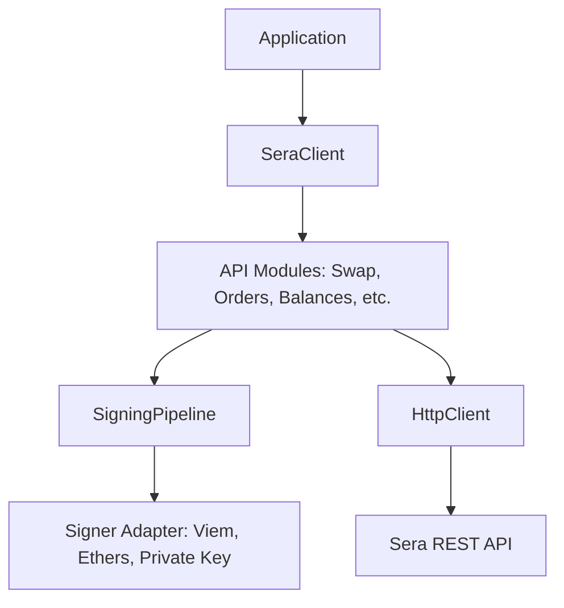

# Sera Protocol TypeScript SDK (Community Edition)

Sera Protocol is a decentralized stablecoin FX settlement layer featuring an on-chain Central Limit Order Book (CLOB). This SDK simplifies stablecoin integration by providing complete type safety, automated credential authentication, EIP-712 cryptographic signing, and resilient transport pipelines. Developers can quickly integrate FX swaps, limit orders, and payments into browsers, backend Node.js, edge functions, or AI agents.

[](https://www.npmjs.com/package/@sera-protocol/sdk)
[](./LICENSE)
[](https://www.typescriptlang.org/)
[](#testing)
[](https://nodejs.org/)

---

### Community Project Disclaimer

> [!NOTE]
> This repository is an independent, community-maintained SDK for Sera Protocol. It is not officially maintained or owned by the Sera Protocol team. The goal is to provide an official-quality developer experience for the community while remaining fully open to feedback, contributions, and future collaboration with the Sera team.

---

### 30-Second Example

Instantiate a client, configure a signer, and execute a swap in four lines of code:

```typescript
import { SeraClient, PrivateKeySignerAdapter } from '@sera-protocol/sdk';

const sera = new SeraClient({
  apiKey: 'YOUR_API_KEY',
  signer: new PrivateKeySignerAdapter('0xYOUR_PRIVATE_KEY_HEX'),
});

// Automatically prepares, signs the EIP-712 intent, and submits the transaction
const result = await sera.swap.execute({
  from: 'USDC',
  to: 'EURC',
  amount: '1000.00',
});

console.log(`Swap complete. Tx Hash: ${result.txHash}`);
```

---

## Table of Contents
1. [Why Sera SDK?](#why-sera-sdk)
2. [Supported Runtimes](#supported-runtimes)
3. [Examples Index](#examples-index)
4. [Installation](#installation)
5. [Authentication & Wallet Adapters](#authentication--wallet-adapters)
6. [Core Modules & Examples](#core-modules--examples)
7. [Architecture](#architecture)
8. [Error Handling & Debugging](#error-handling--debugging)
9. [TypeScript Safety](#typescript-safety)
10. [FAQ](#faq)
11. [Contributing](#contributing)
12. [License](#license)

---

## Why Sera SDK?

Integrating directly with decentralized order books and routing systems via raw REST endpoints introduces substantial integration complexity. This SDK abstracts these tasks into safe, high-level primitives:

*   **Fully Typed API**: Strong TypeScript interfaces for all requests, responses, and events.
*   **Automatic EIP-712 Signing**: Handles domain separator construction, hex-packing, and signature execution under the hood.
*   **Browser & Node.js Support**: Compatible across web browsers, backend scripts, Next.js, and Edge environments.
*   **Production-Ready Examples**: Built-in, fully runnable starter templates for key use cases.
*   **Generated API Documentation**: Comprehensive auto-generated markdown docs synced directly with the source code.
*   **Zero Runtime Dependencies**: Ultra-lightweight footprint utilizing native `fetch` and dynamic peer dependency resolution.
*   **Modern TypeScript-First Design**: Branded types catch common mistakes at compile time rather than runtime.

### REST API vs. TypeScript SDK

| Feature | Raw REST API | Sera TypeScript SDK |
| :--- | :--- | :--- |
| **EIP-712 Signing** | Manual domain construction, message parsing, hex packing, and client execution. | Automatically handled inside the `SigningPipeline`. |
| **Decimal Arithmetic** | Manual parsing of diverse stablecoin decimal units (6 for USDC, 18 for EURC). | Exposes simple base-10 strings, managing conversion internally. |
| **HTTP Retries** | Developer must implement custom exponential retry loops and backoff jitter. | Handled automatically for `429`, `502`, `503`, and `504` errors. |
| **Response Mapping** | Handling raw nested `snake_case` JSON responses. | Returns clean, camelCase TypeScript domain models. |
| **Type Safety** | String parameters allow errors to pass compile time silently. | Branded types (like `Address` or `OrderId`) catch mismatches early. |
| **Developer Effort** | ~150-200 lines of setup code. | 4 lines of code. |

---

## Supported Runtimes

The SDK utilizes standard ECMAScript modules (ESM) and standard global APIs (like native `fetch` and `AbortController`), ensuring compatibility across multiple environments:

*   **Node.js**: Version 18.0.0 or higher.
*   **Browsers**: All modern browsers supporting ESM.
*   **Web Frameworks**: Next.js, React, Vue, Svelte, Vite.
*   **Alternative Runtimes**: Bun, Deno.
*   **Edge Computing**: Cloudflare Workers, Vercel Edge Functions.

---

## Examples Index

We provide three complete, production-quality example applications inside the `examples/` directory:

| Example | Description | Recommended Learning Order |
| :--- | :--- | :--- |
| **[`node-basic`](./examples/node-basic)** | Simple, runnable Node.js CLI script displaying client initialization, configs, and quote checks. | 1. Basic Onboarding |
| **[`nextjs-payments`](./examples/nextjs-payments)** | Modern App Router application showcasing server-side SDK execution and status polling. | 2. Web Integration |
| **[`ai-agent`](./examples/ai-agent)** | Flagship AI Agent natural language transaction simulator executing orders through semantic parsing. | 3. Advanced Orchestration |

---

## Installation

Install the package via your preferred package manager:

```bash
# npm
npm install @sera-protocol/sdk

# pnpm
pnpm add @sera-protocol/sdk

# yarn
yarn add @sera-protocol/sdk

# bun
bun add @sera-protocol/sdk
```

---

## Authentication & Wallet Adapters

The SDK separates read-only API authentication from EIP-712 transaction execution.

### API Keys
Provide your API key at instantiation. It is injected into outgoing headers and masked in debug logs:
```typescript
const client = new SeraClient({ apiKey: 'YOUR_API_KEY' });
```

### Signer Adapters
Write actions (like placing limit orders, executing swaps, or payments) require EIP-712 signatures. Adapters normalize wallet clients into a single universal interface:

#### Viem Wallet Client
```typescript
import { ViemSignerAdapter } from '@sera-protocol/sdk';
import { createWalletClient, http } from 'viem';
import { mainnet } from 'viem/chains';

const walletClient = createWalletClient({
  chain: mainnet,
  transport: http(),
});

const client = new SeraClient({
  signer: new ViemSignerAdapter(walletClient)
});
```

#### Ethers.js v6 Signer
```typescript
import { EthersSignerAdapter } from '@sera-protocol/sdk';
import { Wallet } from 'ethers';

const wallet = new Wallet('0xYOUR_PRIVATE_KEY');

const client = new SeraClient({
  signer: new EthersSignerAdapter(wallet)
});
```

#### Browser Wallets (Injected Provider)
```typescript
import { BrowserWalletAdapter } from '@sera-protocol/sdk';

const client = new SeraClient({
  signer: new BrowserWalletAdapter() // Automatically resolves window.ethereum
});
```

#### Local Private Key (In-process signing)
```typescript
import { PrivateKeySignerAdapter } from '@sera-protocol/sdk';

const client = new SeraClient({
  signer: new PrivateKeySignerAdapter('0xYOUR_PRIVATE_KEY_HEX') // Resolves viem or ethers peer dependencies
});
```

---

## Core Modules & Examples

### 1. Swaps (`client.swap`)
Execute swaps between stablecoin assets. The high-level API automates all steps, while low-level primitives are exposed for custom routing:
```typescript
// Automated High-Level Swap:
const result = await sera.swap.execute({
  from: 'USDC',
  to: 'EURC',
  amount: '500.00',
  slippageToleranceBps: 50 // 0.50%
});

// Granular Step-by-Step Swap:
const quote = await sera.swap.quote({ inputToken: 'USDC', outputToken: 'EURC', amount: '500.00' });
const intent = sera.swap.buildIntent(quote);
const signature = await sera.swap.sign(intent);
const txResult = await sera.swap.submit(quote.uuid, signature, intent);
```

### 2. Orders (`client.orders`)
Place, list, and cancel limit orders inside the Central Limit Order Book:
```typescript
// Place a Limit Order
const order = await sera.orders.create({
  market: 'USDC/EURC',
  side: 'BUY',
  amount: '1000.00',
  price: '0.9250'
});

// Query open book state with the fluent builder
const openOrders = await sera.orders
  .query()
  .market('USDC/EURC')
  .status('OPEN')
  .limit(20)
  .fetch();

// Cancel Order
await sera.orders.cancel(order.id);
```

### 3. Balances (`client.balances`)
Inspect wallet assets, vault available collateral, and frozen tokens using built-in caching:
```typescript
// Fetch full balance grid (wallet and vault)
const balances = await sera.balances.get('0xUserAddress');

// Access specific balances (resolves via cache automatically)
const walletUsdc = await sera.balances.wallet('USDC');
const availableVaultUsdc = await sera.balances.available('USDC');

// Force bypass cache
const freshBalances = await sera.balances.refresh();
```

### 4. Payments (`client.payments`)
Initiate peer-to-peer transfers with automated gas and route estimation:
```typescript
const payment = await sera.payments.pay({
  recipient: '0xRecipientAddress',
  amount: '150.00',
  asset: 'USDC',
  memo: 'Invoice #2048'
});

// Check payment transaction status
const statusInfo = await sera.payments.status(payment.paymentId);
```

### 5. Virtual Liquidity (`client.virtualLiquidity`)
Deploy multiple limit orders sharing a single unified budget limit:
```typescript
const batch = await sera.virtualLiquidity.createBatch({
  sharedBudget: '10000.00',
  orders: [
    { market: 'USDC/EURC', side: 'BUY', amount: '6000.00', price: '0.9250' },
    { market: 'USDC/EURC', side: 'BUY', amount: '4000.00', price: '0.9240' }
  ]
});

// Cancel active shared batch
await sera.virtualLiquidity.cancelBatch(batch.batchId);
```

### 6. System Metadata (`client.system`)
Access operational metrics and registers:
```typescript
const health = await sera.system.health();
console.log(`Matching Engine Ready: ${health.executorStatus}`);

// Lookup token configurations
const usdcDetails = await sera.system.token('USDC');
```

---

## Architecture

The SDK uses a decoupled, modular design to ensure high reliability and clear separation of concerns:



*   **`SeraClient`**: Central entrypoint. Houses immutable configurations, event emitters, hooks, and initializes namespaces.
*   **`HttpClient`**: The network transport pipeline. Handles native `fetch` execution, auto-retry policies, timeouts, and masks secrets in debug logs.
*   **`AuthEngine`**: Holds authorization credentials and wallet adapter registrations.
*   **`SigningPipeline`**: The EIP-712 orchestrator. Validates wallets, constructs typing payloads via the `TypedDataBuilder`, requests signatures, and normalizes hex parameters.

---

## Error Handling & Debugging

The SDK exposes error classes to handle issues gracefully:

```typescript
import { isSeraError, SeraRateLimitError, SeraValidationError } from '@sera-protocol/sdk';

try {
  await sera.swap.execute({ ... });
} catch (error) {
  if (isSeraError(error)) {
    console.error(`Sera Error: [${error.code}] ${error.message}`);
    if (error instanceof SeraRateLimitError) {
      console.warn(`Rate limited. Retry after ${error.retryAfterSeconds}s`);
    }
  } else {
    console.error('Unknown execution error:', error);
  }
}
```

### Debug Logging
Enable structured debug logs by passing a `debug` flag or a custom logger:
```typescript
const client = new SeraClient({
  debug: true, // Output logs to console automatically
});
```

---

## TypeScript Safety

To prevent bugs like misplacing swap inputs or target order identifiers, the SDK utilizes **Branded Types**:

```typescript
import { Address, toAddress } from '@sera-protocol/sdk';

// Compile error: standard string is not assignable to Address
const badAddress: Address = '0x123...';

// Correct casting:
const goodAddress: Address = toAddress('0x1234567890123456789012345678901234567890');
```

---

## FAQ

### Is this an official SDK?
No. This is a community-maintained TypeScript SDK developed to provide a high-quality, developer-first integration experience for the Sera Protocol.

### Which runtimes are supported?
The SDK runs in any environment supporting standard ESM modules and native `fetch` APIs. This includes Node.js (>=18), modern web browsers, Deno, Bun, Next.js, and edge workers (Cloudflare Workers, Vercel Edge).

### Which wallet libraries are supported?
Through the signer adapters interface, we support **Viem** wallet clients, **Ethers.js v6** signers, browser injected wallet extensions (like MetaMask or Rabby via `window.ethereum`), and raw private key hex strings.

### Where should I start?
For a quick test, we suggest cloning the repository and running the [`examples/node-basic`](./examples/node-basic) script. For web integration, explore the [`examples/nextjs-payments`](./examples/nextjs-payments) App Router project.

### How can I contribute?
Please review our [CONTRIBUTING.md](./CONTRIBUTING.md) guide for details on development setups, vitest commands, and pull request checklist validations.

---

## Contributing

We welcome contributions from the community. Please see our [CONTRIBUTING.md](./CONTRIBUTING.md) for details on code guidelines, testing conventions, and pull request flows.

---

## License

This project is licensed under the MIT License - see the [LICENSE](./LICENSE) file for details.
