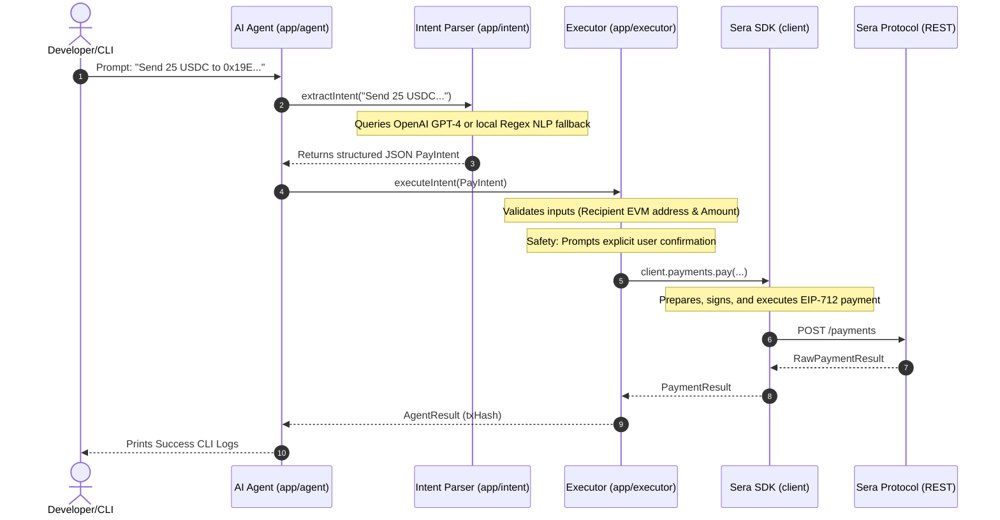

# Sera Protocol SDK - AI Agent Natural Language Simulator

This project demonstrates how to safely orchestrate blockchain transactions and read protocol data using natural language commands. It separates intent extraction (LLM/NLP processing) from EIP-712 transaction execution, ensuring private wallet keys never leave the SDK.

---

## Sequence Flow Diagram



---

## Key Safety & Security Principles

1.  **Signer Isolation**: The LLM model or intent parser never handles the signer credentials or private keys. The LLM only parses natural language parameters into a structured JSON schema.
2.  **Strict Validation**: Structured values extracted by the LLM are validated (e.g., verifying address lengths and checking that amounts are positive) before invoking SDK methods.
3.  **Explicit Consent**: The application prompts for explicit confirmation before submitting write transactions, preventing unauthorized AI actions.
4.  **Local Fallback Support**: If no `OPENAI_API_KEY` is provided, the agent falls back to a local regex parser, ensuring it runs offline instantly.

---

## Directory Structure

```
examples/ai-agent/
├── README.md           # Getting started overview guide
├── package.json        # Dependencies configurations
├── tsconfig.json       # Strict TypeScript configuration
├── .env.example        # Environment variables template
├── src/
│   ├── index.ts        # Agent simulation entrypoint
│   ├── agent.ts        # Orchestrates intent parsing and execution
│   ├── intent.ts       # LLM and local Regex NLP intent parser
│   ├── executor.ts     # Maps parsed intents to SDK methods
│   ├── client.ts       # Shared client singleton instance
│   ├── config.ts       # Typed configurations loader
│   ├── logger.ts       # Console step logging helpers
│   └── types.ts        # Shared typescript models
```

---

## Prerequisites

*   **Node.js**: Version 18.0.0 or higher.
*   **Package Manager**: `npm` | `pnpm` | `yarn` | `bun`.

---

## Installation

1.  Navigate to the directory:
    ```bash
    cd examples/ai-agent
    ```
2.  Install dependencies:
    ```bash
    npm install
    ```

---

## Environment Variables

Copy the template configuration file to configure credentials:
```bash
cp .env.example .env
```

Open `.env` in your editor:
*   `SERA_API_KEY`: Your Sera developer API key credentials.
*   `SERA_PRIVATE_KEY`: A 32-byte hex private key (e.g. `0x...`) used for transaction signatures.
*   `SERA_ENVIRONMENT`: The target environment (`mainnet` | `testnet` | `development`).
*   `OPENAI_API_KEY`: (Optional) If specified, the agent uses GPT-4 for natural language intent parsing. If left blank, it falls back to the local Regex NLP parser.

---

## Running the Simulator

Run the agent simulation:
```bash
npm start
```

---

## Example Prompts Evaluated in Simulator

The simulation runs the following query sequences:
1.  **Account Balances Check**: `"Get my wallet balances"`
2.  **FX Swap Estimate**: `"Swap 500 USDC to EURC"`
3.  **Transfer/Payment Execution**: `"Send 25 USDC to 0x19E7E376E7C213B7E7e7e46cc70A5dD086DAff2A"`
4.  **Unsupported command check**: `"Tell me a joke about blockchain gas fees"`

---

## Expected Output

```
============================================================
🔷 AGENT: Prompt: "Get my wallet balances"
============================================================
ℹ️  [INFO] Extracting semantic intent...
✅ [SUCCESS] Extracted Intent Type: GET_BALANCES
ℹ️  [INFO] Parsed Parameters: {}
ℹ️  [INFO] Executing SDK transaction parameters...
ℹ️  [INFO] Could not connect to API to fetch balances. (Reason: fetch failed)

============================================================
🔷 AGENT: Prompt: "Swap 500 USDC to EURC"
============================================================
ℹ️  [INFO] Extracting semantic intent...
✅ [SUCCESS] Extracted Intent Type: GET_QUOTE
ℹ️  [INFO] Parsed Parameters: {"amount":"500","from":"USDC","to":"EURC"}
ℹ️  [INFO] Executing SDK transaction parameters...
ℹ️  [INFO] Could not connect to API to fetch swap quote. (Reason: fetch failed)

============================================================
🔷 AGENT: Prompt: "Send 25 USDC to 0x19E7E376E7C213B7E7e7e46cc70A5dD086DAff2A"
============================================================
ℹ️  [INFO] Extracting semantic intent...
✅ [SUCCESS] Extracted Intent Type: PAY
ℹ️  [INFO] Parsed Parameters: {"recipient":"0x19E7E376E7C213B7E7e7e46cc70A5dD086DAff2A","amount":"25","asset":"USDC"}
ℹ️  [INFO] Executing SDK transaction parameters...

🛡️  [SAFETY CHECK] TRANSACTION CONFIRMATION REQUEST:
   Action: Send stablecoin transfer
   Recipient: 0x19E7E376E7C213B7E7e7e46cc70A5dD086DAff2A
   Amount: 25 USDC
👉 [CONFIRMED] User approved signing and submission (simulated CLI approval).
ℹ️  [INFO] Could not connect to API to execute payment. (Reason: fetch failed)

============================================================
🔷 AGENT: Prompt: "Tell me a joke about blockchain gas fees"
============================================================
ℹ️  [INFO] Extracting semantic intent...
✅ [SUCCESS] Extracted Intent Type: UNKNOWN
ℹ️  [INFO] Parsed Parameters: {"query":"Tell me a joke about blockchain gas fees"}
ℹ️  [INFO] Executing SDK transaction parameters...
⚠️  [WARNING] I'm sorry, I couldn't understand that instruction. I currently support: paying recipients, checking balances, or requesting swap quote estimations.
```
