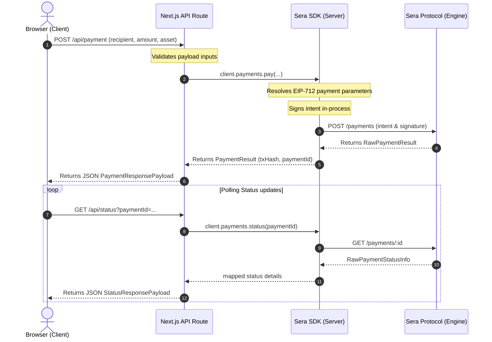

# Sera Protocol SDK - Next.js App Router Payments Demo

This is a complete, production-quality Next.js App Router starter project demonstrating how to integrate the **Sera Protocol TypeScript SDK** into modern server-side React web applications.

---

## Architecture Diagram

The SDK remains isolated server-side. Private wallet signing keys are never leaked to client components.



---

## Features

*   **Server/Client Boundary Separation**: The SDK is instantiated and executed strictly in the Node.js API execution scope. Private wallet keys never hit the browser.
*   **Centralized Input Validation**: Inbound payloads are verified before making any network calls to the protocol.
*   **Decoupled State Polling**: Client components query lightweight endpoints (`/api/status`) to track transaction completions asynchronously.
*   **Graceful Error Mapping**: Intercepts `SeraError` validations and wraps them in clean user-facing HTTP status responses.

---

## Directory Structure

```
examples/nextjs-payments/
├── README.md           # Getting started overview guide
├── package.json        # Dependencies configurations
├── tsconfig.json       # Strict TypeScript configuration
├── next.config.ts      # Next.js configurations
├── .env.example        # Environment variables template
├── app/
│   ├── layout.tsx      # Global App wrapper layout
│   ├── page.tsx        # Dashboard home controller
│   └── api/
│       ├── payment/
│       │   └── route.ts # Payment handler endpoint
│       └── status/
│           └── route.ts # Transaction polling status handler
├── components/
│   ├── PaymentForm.tsx # Payment details collector
│   └── PaymentStatus.tsx # Poller execution progress dashboard
└── lib/
    ├── client.ts       # SDK server client singleton
    ├── config.ts       # Typed configurations loader
    ├── validation.ts   # Centralized validator methods
    └── types.ts        # Shared typescript models
```

---

## Prerequisites

*   **Node.js**: Version 18.0.0 or higher.
*   **Package Manager**: `npm` | `pnpm` | `yarn` | `bun`.

---

## Installation

1.  Navigate to the directory:
    ```bash
    cd examples/nextjs-payments
    ```
2.  Install dependencies:
    ```bash
    npm install
    ```

---

## Environment Variables

Copy the template configuration file to configure credentials:
```bash
cp .env.example .env
```

Open `.env` in your editor and specify your values:
*   `SERA_API_KEY`: Your Sera developer API key credentials.
*   `SERA_PRIVATE_KEY`: A 32-byte hex private key (e.g. `0x...`) used for transaction signatures.
*   `SERA_ENVIRONMENT`: The target environment (`mainnet` | `testnet` | `development`).

---

## Running Locally

To run the Next.js development server:
```bash
npm run dev
```

Open [http://localhost:3000](http://localhost:3000) in your browser to view the portal dashboard.

---

## Security Notes

1.  **Strict Server Isolation**: Never name environment variables with `NEXT_PUBLIC_` if they contain API secrets or private keys. Next.js only exposes variables starting with `NEXT_PUBLIC_` to client components.
2.  **Input Verification**: Always assume client input is malicious. The SDK includes validation hooks, but you should always run pre-checks like `validatePaymentRequest` on request payloads before hitting protocol engines.
